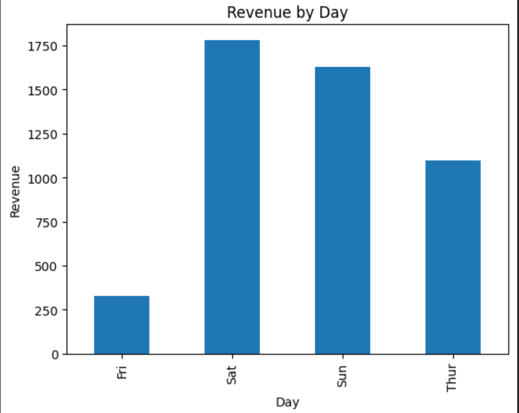
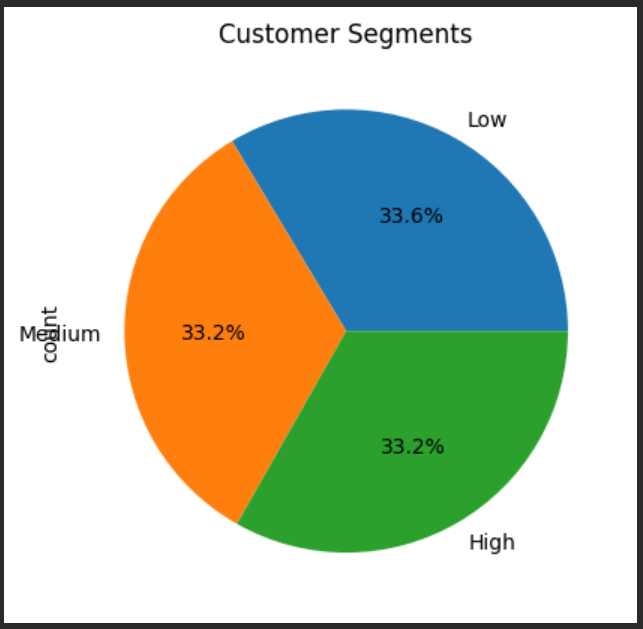

# Cloud-Based E-Commerce Analytics Platform

## Overview
This project demonstrates a cloud-based analytics workflow for analysing e-commerce transaction data using Google BigQuery, SQL, Python, and Google Cloud Run.

The aim was to build a scalable reporting workflow that can process large transaction datasets, identify revenue trends, highlight top-performing product categories, and segment customers for marketing and inventory decisions.

## Business Problem
E-commerce teams need fast access to reliable sales and customer insights. Manual spreadsheet reporting can be slow, difficult to scale, and prone to errors.

This project explores how a serverless analytics workflow can support:

- Monthly revenue tracking
- Product category performance analysis
- Customer segmentation
- High-value customer identification
- Marketing and inventory planning

## Dataset
The project uses an e-commerce transaction dataset containing 100,000+ records.

Key fields include:

- Order ID
- Customer ID
- Product category
- Product name
- Sale price
- Order date
- Customer segment indicators

## Tools Used
- SQL
- Google BigQuery
- Google Cloud Run
- Python
- Pandas
- Power BI / dashboarding
- Git

## Methodology
1. Loaded transaction data into BigQuery.
2. Wrote SQL queries to aggregate revenue, product, and customer behaviour metrics.
3. Analysed monthly sales trends and category-level performance.
4. Segmented customers based on purchasing behaviour.
5. Built reporting outputs and dashboard visuals.
6. Designed a Cloud Run workflow to allow analytics jobs to be triggered through API calls.

## Key Analysis

### Monthly Revenue Trends
Analysed monthly sales patterns to identify demand changes and revenue growth over time.

### Product Category Performance
Identified top-performing products and categories based on total revenue and transaction volume.

### Customer Segmentation
Grouped customers based on purchasing behaviour to support more targeted marketing decisions.

### Reporting Automation
Designed a serverless workflow to reduce manual reporting effort and avoid dedicated infrastructure management.

## Key Results
- Processed 100,000+ e-commerce transaction records in BigQuery.
- Built SQL queries for monthly revenue, product performance, and customer segmentation.
- Identified high-value customer groups and product categories for business decision-making.
- Demonstrated how serverless analytics can reduce reporting and infrastructure overhead.

## Business Impact
This project shows how cloud analytics can help e-commerce teams make faster decisions around:

- Marketing spend
- Inventory planning
- Product prioritisation
- Customer targeting
- Revenue monitoring

## Repository Structure
```text
ecommerce-analytics-platform/
├── sql/
├── notebooks/
├── images/
├── reports/
├── requirements.txt
└── README.md

## Visual Outputs

### Monthly Revenue Trends


### Customer Segments

